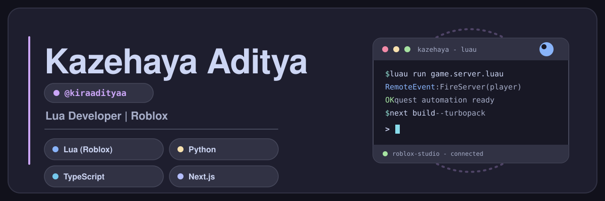

  

  <b>Adityaa</b> · <i>MasAdityaa.lua</i> — Lua (Roblox) developer who also ships Python & TypeScript/Next.js.

  
  
  
  

---

Hi, I'm **Adityaa**. I script Roblox games with **Lua/Luau**, automate and build tools with **Python**, and craft web apps with **TypeScript + Next.js**. I enjoy clean, professional code — whether it's a game script, a browser extension, or a desktop that runs in the cloud.

_Halo, saya **Adityaa**. Saya menulis script game Roblox dengan **Lua/Luau**, membangun tools dan otomasi dengan **Python**, serta membuat aplikasi web dengan **TypeScript + Next.js**._

---

## Stack

  
  
  
  
  
  

- ▸ Game scripting: **Lua / Luau** inside Roblox Studio `while true do ... end`
- ▸ Automation & tooling: **Python** scripts, browsers, workflows
- ▸ Web: **TypeScript**, **Next.js**, frontend craft
- ▸ Systems: Linux, GitHub Actions, Chrome Remote Desktop

## Stats

  
  

  

## Featured projects

- **[rich-linux-crd](https://github.com/kiraadityaa/rich-linux-crd)** — Ubuntu 24.04 desktop (Cinnamon & GNOME) on GitHub Actions + Chrome Remote Desktop, with Chrome, VS Code and OpenCode preinstalled.
- **[discord-auto-quest](https://github.com/kiraadityaa/discord-auto-quest)** — Browser extension that auto-completes Discord quests, with a "super-safe" anti-detection mode (for education/research).
- **[script-emote](https://github.com/kiraadityaa/script-emote)** — Grab Roblox emotes and animations for free.
- **[portfolio](https://github.com/kiraadityaa/portfolio)** — My Next.js web presence.

## Connect

  <a href="https://instagram.com/aaaditz_">Instagram: <code>aaaditz_</code></a> ·
  <a href="https://tiktok.com/@kiraadityaa">TikTok: <code>kiraadityaa</code></a> ·
  <a href="https://wa.me/6281553362795">WhatsApp: <code>6281553362795</code></a> ·
  <a href="https://pt-andromega.vercel.app">pt-andromega.vercel.app</a>

---

<i>Lua Developer | Roblox Exploit</i> — <code>while true do build(stuff) end</code>
